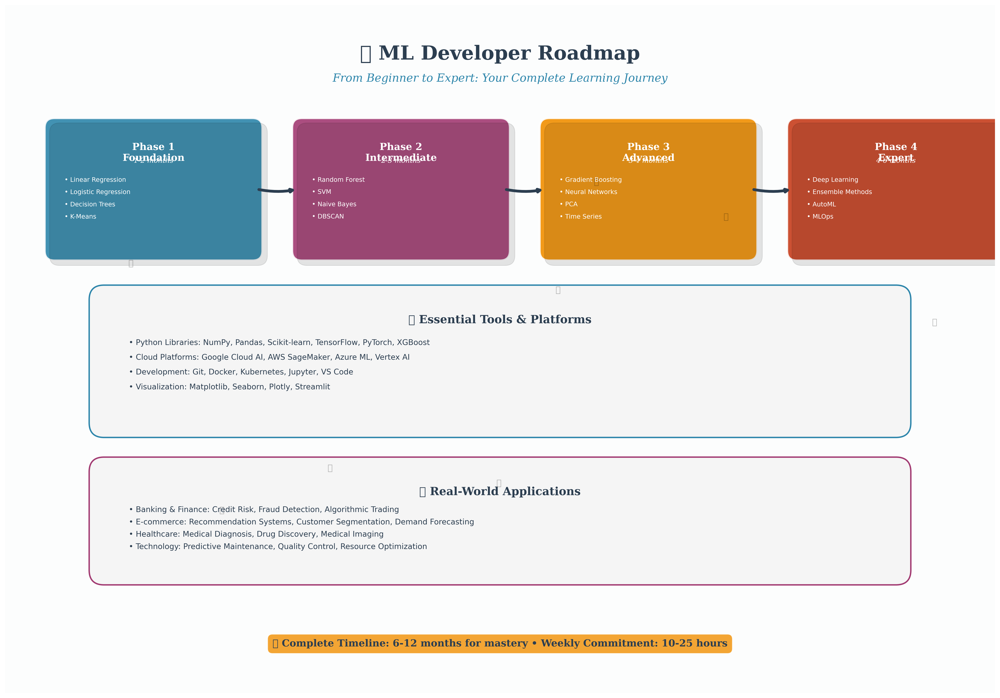

# ML Developer Roadmap 🚀

## Complete Learning Path: From Beginner to Expert

### 🎨 Interactive Roadmap
**Click here for the interactive version**: [**Interactive ML Developer Roadmap**](docs/ml_roadmap.html) 🚀

*Beautiful, zoomable, and interactive roadmap with hover effects and animations*

### 📊 Static Version

*Complete ML Developer Learning Path - From Beginner to Expert*

---

## Learning Progression

### Phase 1: Foundation (1-2 months)
**Start your ML journey with these fundamental algorithms:**

- **Linear Regression** - Predict continuous values (prices, scores, etc.)
- **Logistic Regression** - Binary classification (yes/no, spam/not spam)
- **Decision Trees** - Easy to understand, good for feature importance
- **K-Means Clustering** - Group similar data points together

**Why start here?**
- Simple to understand and implement
- Great for learning ML concepts
- Widely used in industry
- Perfect foundation for advanced algorithms

### Phase 2: Intermediate (2-3 months)
**Build on your foundation with more powerful algorithms:**

- **Random Forest** - Ensemble of decision trees, very robust
- **SVM (Support Vector Machine)** - Great for classification with clear margins
- **Naive Bayes** - Fast and effective for text classification
- **DBSCAN** - Advanced clustering that finds arbitrary shapes

**Skills to develop:**
- Cross-validation and model selection
- Feature engineering techniques
- Hyperparameter tuning
- Model evaluation metrics

### Phase 3: Advanced (3-4 months)
**Master sophisticated ML techniques:**

- **Gradient Boosting** - XGBoost, LightGBM for high performance
- **Neural Networks** - Deep learning foundations
- **PCA (Principal Component Analysis)** - Dimensionality reduction
- **Time Series (ARIMA, Prophet)** - Forecasting and trend analysis

**Advanced concepts:**
- Ensemble methods
- Dimensionality reduction
- Time series analysis
- Neural network architectures

### Phase 4: Expert (4-6 months)
**Become an ML expert with cutting-edge techniques:**

- **Deep Learning** - CNNs, RNNs, Transformers
- **Ensemble Methods** - Stacking, blending, voting
- **AutoML** - Automated machine learning pipelines
- **MLOps** - Production deployment and monitoring

**Expert skills:**
- Model deployment and serving
- A/B testing and experimentation
- Model monitoring and retraining
- Scalable ML systems

---

## Essential Tools & Technologies

### Python Libraries
- **NumPy & Pandas** - Data manipulation and analysis
- **Scikit-learn** - Traditional ML algorithms
- **Matplotlib & Seaborn** - Data visualization
- **TensorFlow/PyTorch** - Deep learning frameworks
- **XGBoost** - Gradient boosting library
- **Streamlit** - Web applications for ML

### Cloud Platforms
- **Google Cloud AI** - Vertex AI, AutoML, BigQuery ML
- **AWS SageMaker** - End-to-end ML platform
- **Azure ML** - Microsoft's ML service
- **Vertex AI** - Google's unified ML platform
- **BigQuery ML** - ML directly in data warehouse
- **Kubernetes** - Container orchestration for ML

### Development Skills
- **Statistics & Probability** - Mathematical foundations
- **Data Preprocessing** - Cleaning and preparing data
- **Feature Engineering** - Creating meaningful features
- **Model Evaluation** - Measuring performance
- **Cross-Validation** - Robust model assessment
- **Hyperparameter Tuning** - Optimizing model performance

---

## Real-World Applications

### Banking & Finance
- **Credit Risk Assessment** - Predict loan defaults
- **Fraud Detection** - Identify suspicious transactions
- **Algorithmic Trading** - Automated trading strategies
- **Customer Segmentation** - Group customers by behavior

### E-commerce & Marketing
- **Recommendation Systems** - Product recommendations
- **Customer Lifetime Value** - Predict customer worth
- **Demand Forecasting** - Predict product demand
- **Price Optimization** - Dynamic pricing strategies

### Healthcare & Life Sciences
- **Medical Diagnosis** - Disease prediction and detection
- **Drug Discovery** - Accelerate pharmaceutical research
- **Medical Imaging** - Analyze X-rays, MRIs, CT scans
- **Patient Risk Stratification** - Identify high-risk patients

### Technology & Operations
- **Predictive Maintenance** - Prevent equipment failures
- **Supply Chain Optimization** - Optimize logistics
- **Quality Control** - Automated defect detection
- **Resource Allocation** - Optimize resource usage

---

## Learning Timeline

### Total Duration: 6-12 months for complete mastery

**Month 1-2**: Foundation algorithms and basic concepts
**Month 3-4**: Intermediate algorithms and practical projects
**Month 5-6**: Advanced techniques and real-world applications
**Month 7-12**: Expert-level skills and specialization

### Weekly Commitment
- **Beginners**: 10-15 hours per week
- **Intermediate**: 15-20 hours per week
- **Advanced**: 20-25 hours per week
- **Expert**: 25+ hours per week

---

## Getting Started

### Prerequisites
- Basic Python programming
- High school mathematics (algebra, statistics)
- Basic understanding of data structures

### Recommended Learning Path
1. **Start with Linear Regression** - This repository's linear regression guide
2. **Practice with real datasets** - Use the provided examples
3. **Build projects** - Apply what you learn to real problems
4. **Join communities** - Kaggle, GitHub, ML forums
5. **Contribute to open source** - Share your knowledge

### Resources
- **This Repository** - Comprehensive algorithm guides
- **Kaggle Learn** - Free ML courses
- **Coursera/edX** - Structured ML courses
- **Books**: "Hands-On Machine Learning", "The Elements of Statistical Learning"
- **Practice**: Kaggle competitions, GitHub projects

---

## Success Metrics

### Beginner Level
- [ ] Can implement basic algorithms from scratch
- [ ] Understands train/test split and cross-validation
- [ ] Can interpret model results and metrics
- [ ] Completed 3-5 small projects

### Intermediate Level
- [ ] Can handle real-world datasets with preprocessing
- [ ] Understands feature engineering techniques
- [ ] Can compare multiple algorithms effectively
- [ ] Completed 5-10 medium projects

### Advanced Level
- [ ] Can implement complex ensemble methods
- [ ] Understands deep learning fundamentals
- [ ] Can optimize hyperparameters effectively
- [ ] Completed 10+ advanced projects

### Expert Level
- [ ] Can design end-to-end ML systems
- [ ] Understands MLOps and production deployment
- [ ] Can lead ML projects and teams
- [ ] Published research or open-source contributions

---
