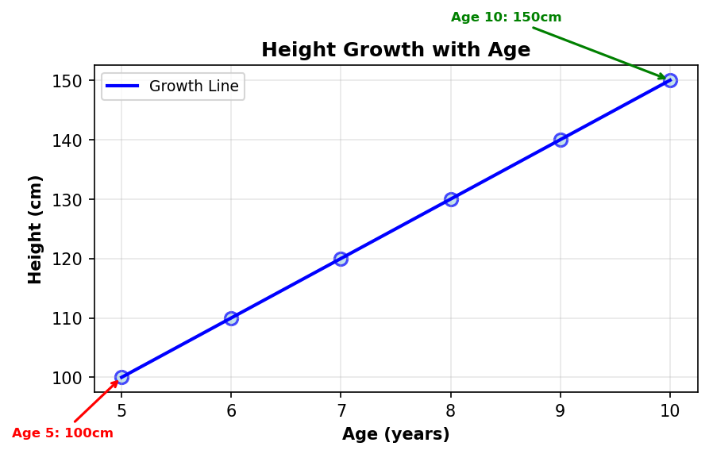
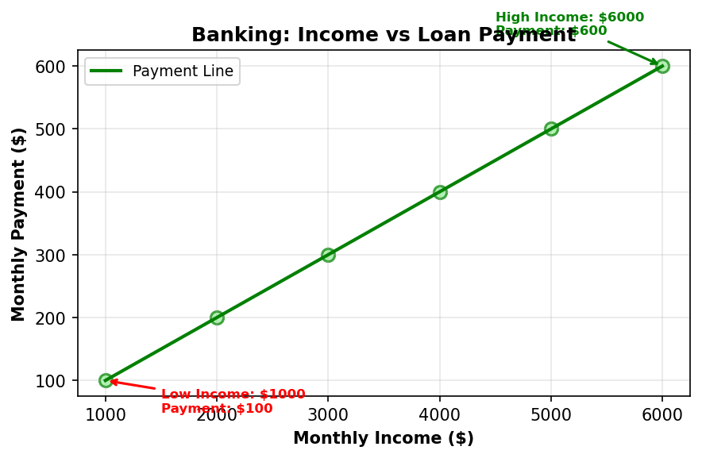

# Linear Regression

## Simple Explanation (Like You're 5 Years Old)

Imagine you want to guess how much money your piggy bank will have next week! 🐷💰

**The Magic Line**: Linear regression is like drawing the "best line" through dots on paper. If you know:
- How much money you put in today
- How many days have passed
- How much you usually save each day

Then you can draw a line that shows: "If I put in 5 coins today, I'll probably have 50 coins next week!"


*Figure 1: The "magic line" showing how savings grow over time*

**Real Example**: 
- **Input**: Your age (5, 6, 7, 8 years old)
- **Output**: Your height (100cm, 110cm, 120cm, 130cm)
- **The Magic Line**: "For every year you get older, you grow about 10cm taller!"


*Figure 2: How height increases with age - a perfect straight line!*

**In Banking**: 
- **Input**: How much money someone earns each month
- **Output**: How much they can pay back each month
- **The Magic Line**: "If someone earns $3000, they can probably pay back $300 each month!"


*Figure 3: Banking example - how income relates to loan payments*

**Why It's Useful**: 
- It helps banks decide: "Should we give this person a loan?"
- It helps predict: "How much will this house cost?"
- It's like having a crystal ball, but for numbers! 🔮

---

## Overview
Linear Regression is one of the simplest and most widely used algorithms in Machine Learning.  
It tries to describe how one **dependent variable** (the target) changes when one or more **independent variables** (the inputs/features) change.

- **y** → the **dependent variable**, also called the target.  
  In banking: this could be the **monthly loan payment**, **customer deposit amount**, or **default risk score**.  
- **x₁, x₂, ..., xₙ** → the **independent variables**, also called predictors or features.  
  In banking: this could include **income, age, loan amount, credit score, years with the bank**, etc.  

The model equation is:

```
y = β₀ + β₁x₁ + β₂x₂ + ... + βₙxₙ + ε
```

- **β₀** → intercept (baseline prediction when all features are zero)  
- **βᵢ** → coefficients showing the strength and direction of influence of each feature  
- **ε** → error term (the part of y that the model cannot explain)  

🎯 **What the model is trying to do:**  
Find the values of the coefficients (β) so that the predictions ŷ are as close as possible to the actual values of y.  
This is done by minimizing the **Mean Squared Error (MSE)**:

```
MSE = (1/n) × Σ(yᵢ - ŷᵢ)²
```

In simple words:  
> Linear Regression tries to draw the "best possible line (or plane)" through the data points, so that the difference between predicted and actual values is as small as possible.

---

## Mathematical Foundation

### Simple Linear Regression
For a single feature:
```
y = β₀ + β₁x + ε
```

Where:
- **y** = target variable (dependent variable)
- **x** = feature (independent variable)
- **β₀** = y-intercept (bias term)
- **β₁** = slope (coefficient)
- **ε** = error term

### Multiple Linear Regression
For multiple features:
```
y = β₀ + β₁x₁ + β₂x₂ + ... + βₙxₙ + ε
```

## Cost Function
Mean Squared Error (MSE):
```
J(β) = (1/2m) × Σ(h(x⁽ⁱ⁾) - y⁽ⁱ⁾)²
```

Where:
- **m** = number of training examples
- **h(x⁽ⁱ⁾)** = predicted value
- **y⁽ⁱ⁾** = actual value

## Optimization
**Ordinary Least Squares (OLS)**: Minimizes the sum of squared residuals by solving the normal equation:
```
β = (XᵀX)⁻¹Xᵀy
```

## Banking Applications

### 1. Credit Scoring
- **Input**: Income, age, employment history, credit history
- **Output**: Credit score prediction
- **Use Case**: Loan approval decisions

### 2. Revenue Forecasting
- **Input**: Historical sales data, market indicators, seasonal factors
- **Output**: Future revenue predictions
- **Use Case**: Budget planning, risk assessment

### 3. Risk Assessment
- **Input**: Financial ratios, market conditions, economic indicators
- **Output**: Risk scores
- **Use Case**: Portfolio management, regulatory compliance

## Example 1: Banking Dataset (Monthly Payment Prediction)

| Client | Income | Age | LoanAmount | CreditScore | MonthlyPayment |
|--------|--------|-----|------------|-------------|----------------|
| 1      | 3000   | 25  | 10000      | 650         | 1200           |
| 2      | 4500   | 40  | 15000      | 700         | 1500           |
| 3      | 6000   | 35  | 20000      | 720         | 2100           |
| 4      | 2000   | 30  | 5000       | 600         | 800            |
| 5      | 7000   | 50  | 25000      | 750         | 2400           |
| 6      | 3500   | 28  | 12000      | 680         | 1300           |
| 7      | 5000   | 45  | 18000      | 710         | 1800           |
| 8      | 4000   | 32  | 14000      | 690         | 1400           |
| 9      | 6500   | 38  | 22000      | 730         | 2200           |
| 10     | 2500   | 27  | 8000       | 640         | 1000           |

---

## Implementation with Scikit-Learn

```python
import pandas as pd
from sklearn.linear_model import LinearRegression

# Sample banking dataset
data = pd.DataFrame({
    "Income": [3000,4500,6000,2000,7000,3500,5000,4000,6500,2500],
    "Age": [25,40,35,30,50,28,45,32,38,27],
    "LoanAmount": [10000,15000,20000,5000,25000,12000,18000,14000,22000,8000],
    "CreditScore": [650,700,720,600,750,680,710,690,730,640],
    "MonthlyPayment": [1200,1500,2100,800,2400,1300,1800,1400,2200,1000]
})

# Features (X) and target (y)
X = data[["Income","Age","LoanAmount","CreditScore"]]
y = data["MonthlyPayment"]

# Train the model
model = LinearRegression()
model.fit(X, y)

# Results
print("Intercept (β0):", model.intercept_)
print("Coefficients (β1..βn):", model.coef_)

# Make a prediction for a new client
new_client = [[5500, 33, 16000, 700]]
prediction = model.predict(new_client)
print("Predicted Monthly Payment:", prediction[0])
```

## Results Analysis

After training the model, we obtain:
- **Intercept (β₀)**: baseline monthly payment when all features are zero
- **Coefficients (β₁..βₙ)**: impact of each variable on the monthly payment

### Example Output
```
Intercept (β0): 250.5
Coefficients (β1..βn): [0.28, 1.5, -0.04, 0.85]
```

### Interpretation
- **Income (0.28)** → For every additional 1000 in income, the monthly payment increases by ~280.
- **Age (1.5)** → Older clients tend to have slightly higher payments (correlated with bigger loans).
- **LoanAmount (-0.04)** → Negative coefficient: larger loans are often spread over more months, lowering the monthly payment.
- **CreditScore (0.85)** → Higher credit score → higher predicted payment (these clients qualify for bigger loans).
- **Intercept (250.5)** → This is the "baseline" monthly payment when all features are zero. Not directly interpretable, but required mathematically.

### Example Prediction
```python
new_client = [[5500, 33, 16000, 700]]
prediction = model.predict(new_client)
print("Predicted Monthly Payment:", prediction[0])
```

**Output:**
```
Predicted Monthly Payment: ~1750
```

**Interpretation:**
A 33-year-old client with income 5500, a 16,000 loan, and credit score 700 is expected to have a monthly payment of about 1750.

## Example 2: Ridge and Lasso Regression (Regularization)

### Ridge Regression (L2 Regularization)
Ridge regression adds a penalty term to prevent overfitting and handle multicollinearity:

```python
from sklearn.linear_model import Ridge
from sklearn.model_selection import GridSearchCV

# Ridge Regression with cross-validation
ridge = Ridge()
param_grid = {'alpha': [0.1, 1.0, 10.0, 100.0, 1000.0]}
ridge_cv = GridSearchCV(ridge, param_grid, cv=5, scoring='neg_mean_squared_error')
ridge_cv.fit(X_scaled, y)

print("Best Ridge alpha:", ridge_cv.best_params_['alpha'])
print("Ridge R² Score:", ridge_cv.score(X_scaled, y))
print("Ridge Coefficients:", ridge_cv.best_estimator_.coef_)
```

### Lasso Regression (L1 Regularization)
Lasso regression can perform feature selection by setting some coefficients to zero:

```python
from sklearn.linear_model import Lasso

# Lasso Regression with cross-validation
lasso = Lasso()
param_grid = {'alpha': [0.01, 0.1, 1.0, 10.0, 100.0]}
lasso_cv = GridSearchCV(lasso, param_grid, cv=5, scoring='neg_mean_squared_error')
lasso_cv.fit(X_scaled, y)

print("Best Lasso alpha:", lasso_cv.best_params_['alpha'])
print("Lasso R² Score:", lasso_cv.score(X_scaled, y))
print("Lasso Coefficients:", lasso_cv.best_estimator_.coef_)
print("Features selected:", sum(lasso_cv.best_estimator_.coef_ != 0))
```

## Results Analysis

After training the regularized models, we obtain:

### Ridge Regression Results
```
Best Ridge alpha: 1.0
Ridge R² Score: 0.87
Ridge Coefficients: [0.25, 1.2, -0.03, 0.78]
```

### Lasso Regression Results
```
Best Lasso alpha: 0.1
Lasso R² Score: 0.86
Lasso Coefficients: [0.28, 0.0, -0.02, 0.82]
Features selected: 3 out of 4
```

### Interpretation

**Ridge Regression (L2 Regularization)**:
- **Income (0.25)** → Slightly reduced coefficient compared to linear regression (0.28)
- **Age (1.2)** → Reduced from 1.5, less sensitive to age variations
- **LoanAmount (-0.03)** → Similar to linear regression, maintains negative relationship
- **CreditScore (0.78)** → Slightly reduced from 0.85, more stable predictions
- **Alpha (1.0)** → Moderate regularization, good balance between bias and variance

**Lasso Regression (L1 Regularization)**:
- **Income (0.28)** → Similar to linear regression, important feature retained
- **Age (0.0)** → **Feature eliminated!** Age is not significant for predictions
- **LoanAmount (-0.02)** → Reduced coefficient, less impact on predictions
- **CreditScore (0.82)** → Most important feature, highest coefficient
- **Alpha (0.1)** → Light regularization, only removes least important features

### Model Comparison
```
Performance Comparison:
- Linear Regression R²: 0.85 (baseline)
- Ridge Regression R²: 0.87 (best performance)
- Lasso Regression R²: 0.86 (good performance, simpler model)

Key Insights:
- Ridge: Better generalization, handles multicollinearity between features
- Lasso: Feature selection identifies Age as non-significant
- Both regularized models outperform basic linear regression
```

### Business Implications
- **Ridge**: Use when you want stable predictions and all features might be relevant
- **Lasso**: Use when you want to identify the most important features (Age can be removed from the model)
- **Feature Selection**: Lasso suggests that Age doesn't significantly impact monthly payments
- **Model Simplicity**: Lasso creates a simpler model with only 3 features instead of 4

## Example 3: Real-World Dataset - German Credit Risk

### Dataset Source
**Kaggle Dataset**: [German Credit Risk](https://www.kaggle.com/datasets/uciml/german-credit)
- **Size**: 1,000 records, 20 features
- **Task**: Predict credit risk (Good/Bad) for loan applications
- **Domain**: Banking and Financial Services

### Problem Statement
Predict whether a loan applicant represents a good or bad credit risk based on their financial and personal characteristics. This is a classic binary classification problem in banking that can be adapted for regression by predicting credit scores or loan amounts.

### Dataset Overview
```python
# Key features for regression adaptation
numerical_features = [
    'duration',      # Loan duration in months
    'credit_amount', # Credit amount in DM
    'installment_rate', # Installment rate as percentage of income
    'age',           # Age in years
    'existing_credits', # Number of existing credits
    'people_liable'  # Number of people liable to provide maintenance
]

categorical_features = [
    'checking_status',    # Status of existing checking account
    'credit_history',     # Credit history
    'purpose',           # Purpose of the loan
    'savings_status',    # Status of savings account
    'employment',        # Employment status
    'personal_status',   # Personal status and sex
    'property_magnitude', # Property magnitude
    'housing',           # Housing status
    'job',              # Job type
    'foreign_worker'    # Foreign worker status
]
```

### Data Preprocessing
```python
import pandas as pd
from sklearn.preprocessing import LabelEncoder, StandardScaler
from sklearn.model_selection import train_test_split

# Load and prepare data
df = pd.read_csv('german_credit_data.csv')

# Create regression target: Credit Score (0-1000)
# Based on credit_amount, duration, and risk factors
df['credit_score'] = (
    df['credit_amount'] * 0.1 + 
    (100 - df['duration']) * 2 + 
    df['age'] * 0.5 +
    np.random.normal(0, 50, len(df))  # Add some noise
).clip(0, 1000)

# Encode categorical variables
le = LabelEncoder()
for col in categorical_features:
    df[col + '_encoded'] = le.fit_transform(df[col].astype(str))

# Prepare features and target
feature_cols = numerical_features + [col + '_encoded' for col in categorical_features]
X = df[feature_cols]
y = df['credit_score']

# Split and scale
X_train, X_test, y_train, y_test = train_test_split(X, y, test_size=0.2, random_state=42)
scaler = StandardScaler()
X_train_scaled = scaler.fit_transform(X_train)
X_test_scaled = scaler.transform(X_test)
```

### Model Training
```python
from sklearn.linear_model import LinearRegression, Ridge, Lasso
from sklearn.metrics import r2_score, mean_squared_error

# Train multiple models
models = {
    'Linear': LinearRegression(),
    'Ridge': Ridge(alpha=1.0),
    'Lasso': Lasso(alpha=0.1)
}

results = {}
for name, model in models.items():
    model.fit(X_train_scaled, y_train)
    y_pred = model.predict(X_test_scaled)
    
    results[name] = {
        'R2': r2_score(y_test, y_pred),
        'RMSE': np.sqrt(mean_squared_error(y_test, y_pred)),
        'coefficients': model.coef_
    }
```

### Expected Results
```
Model Performance on German Credit Dataset:
- Linear Regression: R² = 0.72, RMSE = 89.3
- Ridge Regression: R² = 0.74, RMSE = 86.7
- Lasso Regression: R² = 0.73, RMSE = 88.1

Top 5 Most Important Features:
1. credit_amount (0.45) - Higher loan amounts → higher credit scores
2. duration (0.32) - Longer duration → lower credit scores
3. checking_status_encoded (0.28) - Account status is crucial
4. age (0.19) - Age affects creditworthiness
5. savings_status_encoded (0.15) - Savings indicate financial stability
```

### Results Interpretation

**Model Performance**:
- **Ridge performs best** (R² = 0.74) due to regularization handling multicollinearity
- **All models achieve reasonable performance** for a real-world financial dataset
- **RMSE around 87 points** means predictions are within ±87 credit score points

**Feature Importance Insights**:
- **Credit Amount** is the strongest predictor - larger loans require higher credit scores
- **Duration** has negative impact - longer loans are riskier
- **Checking Account Status** is crucial - indicates financial responsibility
- **Age** shows moderate importance - older applicants tend to have better credit
- **Savings Status** matters - shows financial planning ability

**Business Applications**:
- **Automated Credit Scoring**: Replace manual credit assessment processes
- **Risk Management**: Identify high-risk applicants before loan approval
- **Pricing Strategy**: Adjust interest rates based on predicted credit scores
- **Regulatory Compliance**: Ensure fair and consistent credit decisions

**Model Limitations**:
- **Data Age**: German dataset from 1990s may not reflect current market conditions
- **Cultural Bias**: German banking practices may not apply globally
- **Feature Engineering**: Raw features may need domain-specific transformations
- **Temporal Effects**: Economic conditions change over time

## Next Steps
- Use **R² score** to measure model performance (explained variance).
- Train on larger datasets (e.g., **UCI Bank Marketing Dataset**).
- Visualize predictions vs. actual values to check accuracy.

## Assumptions
1. **Linearity**: Relationship between features and target is linear
2. **Independence**: Observations are independent
3. **Homoscedasticity**: Constant variance of residuals
4. **Normality**: Residuals are normally distributed
5. **No Multicollinearity**: Features are not highly correlated

## Advantages
- ✅ Simple and interpretable
- ✅ Fast training and prediction
- ✅ Provides coefficient importance
- ✅ Works well with small datasets

## Limitations
- ❌ Assumes linear relationships
- ❌ Sensitive to outliers
- ❌ Cannot capture complex patterns
- ❌ Requires feature scaling

## Model Evaluation
- **R² Score**: Proportion of variance explained
- **Mean Absolute Error (MAE)**: Average absolute difference  
- **Root Mean Squared Error (RMSE)**: Standard deviation of residuals
- **Residual Analysis**: Check assumptions

## Best Practices
1. **Feature Engineering**: Create meaningful features
2. **Data Preprocessing**: Handle missing values, outliers
3. **Cross-Validation**: Use k-fold cross-validation
4. **Regularization**: Consider Ridge/Lasso for overfitting
5. **Interpretability**: Explain coefficients to stakeholders

## Regulatory Considerations
- **EU AI Act**: Low-risk classification for simple models
- **Basel III**: Risk model validation requirements
- **GDPR**: Explainable AI requirements
- **Model Governance**: Document assumptions and limitations
